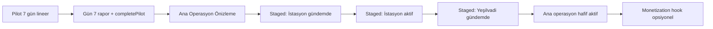

# Post-Pilot Unlock Design Audit — Crevia

**Tarih:** 2026-05-30  
**Kapsam:** 7 günlük pilot sonrası ana operasyon, mahalle açılımı, yetki, progression bridge, monetization hazırlığı  
**Tür:** Ürün + teknik uygulama planı (implementasyon yok)

---

## 1. Mevcut Durum

### 1.1 7 günlük pilot nasıl bitiyor?

| Aşama | Davranış | Kaynak |
|--------|----------|--------|
| Günlük ilerleme | `pilot.status === 'active'`, `currentPilotDay` 1–7; `endCurrentDay` gün sonu raporu üretir | `useGameStore.endCurrentDay`, `syncCityDayWithPilotDay` |
| Gün 7 kapanış olayı | `shared_day7_final_pilot_report_pressure` tamamlanınca `canCompletePilot()` true olur | `calculatePilotFinalResult.ts` |
| Pilot kapanışı | `completePilotFromCurrentState()` veya `completePilot(finalResult)` | `FinalPilotReportScreen`, `useGameStore` |
| UI yüzeyleri | Gün 7 rapor → `ReportPilotCompletionCard` / footer CTA **Ana Operasyona Göz At** → `MAIN_OPERATION_PREVIEW_ROUTE` (`/events/main-operation-preview`) | `ReportScreen`, `pilotCompletionTypes.ts` |

**`canCompletePilot` koşulları:** `status === 'active'`, `currentPilotDay === 7`, `completedEventIds` içinde `PILOT_FINAL_EVENT_ID`.

### 1.2 `completePilot` şu an ne yapıyor?

`useGameStore.completePilot` (özet):

1. **Yetki:** `processPilotCompletionAuthority` — gün 7 pilot skoru ile `evaluateAuthorityPromotion`, `authorityState` güncellenir, `lastEvaluation` snapshot.
2. **Rozet:** `processPilotCompletionBadgeEvaluation` — pilot final rozetleri (`pilot_finisher` vb.), duplicate guard (`skipIfAlreadyApplied`).
3. **Pilot run:** `recordPilotDailySnapshot` + `finalizePilotRun` → `run.isCompleted = true`, `unlockState = unlockStateForCompletedRun()`.
4. **Durum:** `pilot.status = 'completed'`, `finalResult` saklanır.
5. **Olaylar:** `clearActiveEventsForGameState` — `events: []`, `featuredEventId: ''`; `eventPool: []`.
6. **Liderlik:** `buildPilotLeaderboardPersistUpdate` — `bestPilotScores`, `lastPilotScore`.
7. **Rapor:** `mergeAuthorityEvaluationIntoDailyReport` — son günlük rapora yetki satırları eklenir.

**Önemli:** `fullMainOperationUnlocked` **hiçbir zaman** `true` yapılmıyor.

```typescript
// pilotRun.ts — finalize sonrası unlock
unlockStateForCompletedRun(): {
  cityMapPreviewUnlocked: true,
  mainOperationPreviewUnlocked: true,
  fullMainOperationUnlocked: false,  // ← ana operasyon hâlâ kapalı
}
```

### 1.3 `MainOperationPreview` şu an ne gösteriyor?

Route: `/events/main-operation-preview` → `MainOperationPreviewScreen`.

| Bölüm | İçerik |
|--------|--------|
| Header | “Ana Operasyon Önizlemesi” — bilgi alert’i: tam mod henüz açılmadı, günlük kararlar için **Operasyon sekmesi** |
| Chips | Pilot tamamlandı / rapor hazır / ana operasyon kilitli |
| `OperationPreviewAuthorityCard` | Pilot sonrası `authorityState` özeti |
| `ProgressionBridgeCard` | `buildProgressionBridgeSummary` — sıradaki kapsam önizlemesi |
| Roadmap | Pilot ✓ → Şehir haritası (sıradaki) → Çoklu mahalle (yakında) → Ana operasyon (geniş mod / önizleme) |
| Hero | “Şehir Ölçeğine Geçiş Hazırlanıyor” — overlay **Yakında Açılacak** veya **Önizleme Modu** |
| Systems grid | Statik kartlar — çoğu “Kilitli” / “Önizleme” etiketli (`operationPreviewData.ts`) |
| Footer | Pilot raporuna dön, Merkez, Liderlik — **Ana operasyona geçiş CTA yok** |

`useOperationPreviewState`: `mainLocked = !run.unlockState.fullMainOperationUnlocked` (varsayılan her zaman kilitli).

### 1.4 Progression Bridge neyi sadece preview olarak gösteriyor?

Tanımlar: `PROGRESSION_PREVIEW_DEFINITIONS` (`progressionBridge.ts`).

| ID | Başlık | Gerekli rütbe | Güven eşiği | `near` eşiği |
|----|--------|---------------|-------------|--------------|
| `neighborhood_istasyon` | İstasyon Mahallesi Önizlemesi | Operasyon Sorumlusu | 450 | 350 |
| `neighborhood_yesilvadi` | Yeşilvadi Operasyon Önizlemesi | Birim Şefi | 1200 | 900 |
| `operation_scope_main` | Ana Operasyon Kapsamı | Bölge Koordinatörü | 2500 | 1800 |
| `system_crisis_desk` | Kriz Masası Önizlemesi | Daire Başkan Yardımcısı | 4500 | 3500 |

**Durumlar:** `locked_preview` | `near` | `available_preview` | `completed` — hepsi **UI/presentation**; haritada mahalle seçilebilirliği veya event üretimini **değiştirmiyor**.

Pilot raporunda: `buildProgressionBridgePilotReportLines` → “Sıradaki kapsam: …” + güven satırı.

Sunum etiketleri: “Önizleme”, “Yaklaşıyor”, “Kapsam hazır” — yasaklı kelimelerden kaçınılmış (`kilitli` presentation’da kullanılmıyor).

### 1.5 Yetki ve rozetler pilot sonrasında

**Yetki (`pilot.authorityState`):**

- Pilot boyunca günlük `authorityTrust` kazanımı + gün 7 `processPilotCompletionAuthority`.
- Tipik pilot sonu: `field_coordinator` veya `promotion_candidate` → `operations_responsible` adayı (skora bağlı).
- **Gerçek etki bugün:** `authorityPermissionPreview` karar kartlarında (gün > 1); pilot sonrası aktif olay olmadığı için pratik etki **düşük**.

**Rozetler (`pilot.badgeState`):**

- Günlük + pilot completion evaluation (`pilot_finisher` vb.).
- Profil / rapor özetleri; gameplay unlock’a bağlı değil.

**Persist:** `SAVE_VERSION = 12`; `pilot`, `authorityState`, `badgeState` `gameState.pilot` altında normalize edilir (`gamePersist.ts`).

### 1.6 Harita / mahalle yapısı (bugün)

- `MAP_DISTRICT_IDS`: cumhuriyet, merkez, sanayi, **istasyon**, **yesilvadi**.
- Pilot bölgesi → tek `pilotMapDistrict` aktif; diğerleri `watching` / `preview` / `approaching`.
- Gün ≥ 5: istasyon & yesilvadi strip’te `approaching` — **yalnızca görsel**, seçim/detay CTA gerçek unlock değil.
- `MapScreen` → `selectedPinId` null-safe; operasyon paneli presentation modeli.

### 1.7 Event generation / pilot systems (bugün)

| Durum | Event üretimi |
|--------|----------------|
| `pilot.status === 'active'` | `ensureDailyEventsForDay` → `generateDailyEventSet` (anchor + side + quick + opportunity + butterfly) |
| `pilot.status === 'completed'` | `resolvePilotEventPoolForGameState` → **boş pool**, refresh yok |
| `canCompletePilot` (gün 7 final beklerken) | `shouldClearPilotActiveEvents` → aktif olaylar temizlenir |

**Günlük slot dengesi (pilot):** `getDailyEventCounts` — örn. gün 4: 1 anchor + 3 side + 1 quick; gün 7: 1 anchor + 2 side.

**Post-pilot:** Şu an **yeni gün / yeni olay döngüsü yok**. Oyuncu Merkez’de kalır; Operasyon sekmesi eski `EventsDecisionCenter` akışına bağlı ama pool boş.

### 1.8 Navigation & store özeti

**Tab rotaları:** `index` (Merkez), `events`, `risks`, `progression`, `reports`, `social`/`profile`/`leaderboard` (href null veya stack).

**Pilot sonrası stack rotaları:**

- `/events/main-operation-preview`
- `/events/pilot-final-report`
- `/reports` (gün sonu)

**Store ana alanları:** `gameState.pilot`, `gameState.city`, `eventPool`, `decisionHistory`, `lastDailyReport`, alt sistem state’leri (container, vehicle, social, personnel, hub quick actions).

**Full UX verify:** Workflow CTA’ları, Day 7 CTA, Day 1 compact rapor — post-pilot **aktif oyun döngüsü tanımlı değil**.

---

## 2. Ana Tasarım Sorusu — Üç Model

### Model A: Sıralı Mahalle Açılımı

Pilot sonrası İstasyon gündeme gelir → yetki/trust ile “aktif kapsam” → sonra Yeşilvadi.

| Avantaj | Dezavantaj |
|---------|------------|
| Progression Bridge ile **doğrudan hizalı** (zaten İstasyon → Yeşilvadi sırası var) | Oyuncu “neden hâlâ oynayamıyorum?” hissi (sadece preview uzarsa) |
| Retention: net kısa vadeli hedefler | Harita 5 bölge + 2 yeni mahalle = UI karmaşası riski |
| Yetki sistemine **anlamlı bağ** | Event generation mahalle başına çoğalırsa şişme |
| Monetization: “Yeşilvadi erken erişim” paketi ileride mümkün | `SAVE_VERSION` + staged state migration |

### Model B: Yeni Pilot Seçimi

7. gün sonunda yeni pilot bölgesi seçimi; her pilot farklı tema/mahalle seti.

| Avantaj | Dezavantaj |
|---------|------------|
| Tekrar oynanabilirlik (replay) | **En yüksek içerik maliyeti** (yeni 7 günlük set × N bölge) |
| Farklı tema satışı (sezon/paket) | Mevcut `PilotRun` / leaderboard / tek `completed` akışıyla çakışma |
| Oyuncu “yeniden başlar” netliği | Progression Bridge “şehir genişlemesi” anlatısıyla zayıf uyum |
| | Pilot sonrası “ana operasyon” vaadi ertelenir |

### Model C: Ana Operasyon Genişleme Modu

Pilot = eğitim; sonra aynı şehirde çoklu mahalle yönetimi; yetki/rozet/bridge buna bağlanır.

| Avantaj | Dezavantaj |
|---------|------------|
| **Mevcut UI anlatısıyla uyum** (MainOperationPreview hero, roadmap) | Kapsam geniş; fazla feature aynı anda açılırsa boğulma |
| Tek şehir, tanıdık harita | `fullMainOperation` + multi-district event engine birlikte tasarlanmalı |
| Authority + badge + bridge **tek progression omurgası** | Gün 8+ `city.day` semantiği netleştirilmeli |
| Operasyon sekmesi anlamlı kalır | Balance simülasyonu zorunlu |

---

## 3. En Mantıklı Ürün Kararı

**Öneri: Model C’yi temel al, Model A’nın sıralı mahalle hattını içsel faz olarak uygula (hibrit).**

| Kriter | Değerlendirme |
|--------|----------------|
| Mobil retention | Model C: günlük tek “operasyon gündemi” + haftalık kapsam hedefi; Model B içerik yükü nedeniyle yavaş |
| Oyuncu karmaşası | Aşamalı activation (preview → gündemde → aktif) B’den düşük, saf A’dan daha az “sahte kilit” |
| UI yükü | Önce **hub + map strip + progression card**; tam 5 mahalle simülasyonu sonra |
| Teknik risk | C + staged state: mevcut bridge/authority/map’e en az sıçrama |
| Monetization | C: sezon / ek bölge paketi; B: yeni pilot DLC; A: tek mahalle IAP — C en esnek |
| Mevcut sistemler | `ProgressionBridge`, `PilotUnlockState`, `MapNeighborhoodStrip`, `authorityTrust` zaten C+A yönünde |

**Model B** şu an için **ertelenmeli** — içerik ve persist modeli çift pilot koşusunu desteklemiyor.

---

## 4. Önerilen Hibrit Model (Detay)

### 4.1 Fazlar



### 4.2 İlk 7 gün — yarı lineer pilot (mevcut, korunur)

- Tek `selectedDistrictId` (Cumhuriyet / Merkez / Sanayi pilot profilleri).
- `getDailyEventCounts` dengesi korunur.
- Gün 7 final → `completePilot` — **değişmez**.

### 4.3 Pilot sonrası — Ana Operasyon Önizleme (mevcut, genişletilir)

- CTA: rapor / hub → `MainOperationPreview`.
- Oyuncuya: roadmap, authority, progression bridge, pilot mirası metrikleri.
- **Yeni:** “Sonraki adım” tek CTA — *Operasyon gündemini başlat* (henüz tam simülasyon değil, state flip).

### 4.4 Staged activation (gerçek kilit değil)

| Aşama | Oyuncu dili | Sistem |
|-------|-------------|--------|
| Preview | “Önizleme” | `locked_preview` (mevcut) |
| On agenda | “Bu hafta odağın: İstasyon” | `PostPilotScopeStatus = 'agenda'` |
| Active | “İstasyon operasyonu açık” | `'active'` — event + map focus |
| Matured | “Rutin stabil” | `'stable'` — Yeşilvadi için tekrar |

**Tetikleyiciler (öneri):**

- İstasyon `agenda`: `mainOperationPreviewUnlocked` + (`authorityTrust >= 350` VEYA `promotion_candidate` for operations_responsible).
- İstasyon `active`: `formalRankId >= operations_responsible` VEYA manuel “gündemi kabul et” (ilk patch’te sadece trust/rank).
- Yeşilvadi: İstasyon `active` + `authorityTrust >= 900` → `near` → `agenda`.

**Paywall yok:** `coming_soon` / `season_teaser` enum; satın alma UI’si yok.

### 4.5 Ana operasyon “hafif aktif” (MVP post-pilot)

- `fullMainOperationUnlocked: true` **ama** kısıtlı:
  - 1 aktif mahalle (İstasyon) + pilot bölgesi izleme modu.
  - Günlük: **1 ana olay + 1 yan olay** (pilotun 1+2’sinden sadeleştirilmiş).
  - Hub: “Bugünkü operasyon gündemi” kartı (kritik olay kartıyla birleşik veya üstüne).

### 4.6 Monetization (sonra)

- `ContentPackId` / `SeasonId` — sadece data + feature flag.
- Örnek: “Yeşilvadi Erken Sezon” → `yesilvadi` staged activation hızlandırır; **varsayılan pilot bitiren oyuncu paywall görmez**.

---

## 5. Teknik Uygulama Planı

### Aşama 1 — Post-pilot operation state modeli

**Amaç:** Gerçek mahalle unlock / event üretimi olmadan durum makinesi.

**Önerilen tip** (`src/core/postPilot/postPilotOperationTypes.ts`):

```typescript
export type PostPilotPhase =
  | 'pilot_only'           // active pilot
  | 'pilot_complete_idle'  // completed, henüz önizleme görülmedi
  | 'preview_seen'         // MainOperationPreview ziyaret
  | 'main_operation_light' // hafif aktif döngü
  | 'main_operation_full'; // ileride

export type ScopeActivationStatus =
  | 'dormant' | 'preview' | 'agenda' | 'active' | 'stable';

export type PostPilotOperationState = {
  phase: PostPilotPhase;
  scopes: {
    istasyon: ScopeActivationStatus;
    yesilvadi: ScopeActivationStatus;
    main_operation: ScopeActivationStatus;
  };
  previewSeenAt?: string;
  lightOperationStartedAt?: string;
};
```

**Persist yeri (öneri):** `gameState.pilot.postPilotOperation` veya root-level `postPilotOperationState` (normalize fonksiyon ile).

**SAVE_VERSION:** İlk patch **opsiyonel** — alan yoksa `normalize` ile `pilot_complete_idle` + tüm scope `preview` (completed pilot için). Gerçek migration gerekirse **v13** (tek seferlik, default-safe).

**Store:** `selectPostPilotPhase`, `markMainOperationPreviewSeen()`, `advancePostPilotPhase()` — **oyun metriklerine dokunmaz**.

**Bridge bağlantısı:** `resolveScopeActivationFromAuthority(authorityState, postPilot)` — presentation + state sync.

---

### Aşama 2 — MainOperationPreview → hafif Ana Operasyon Merkezi

| Soru | Cevap |
|------|--------|
| Yeni route gerekir mi? | **İlk patch:** Hayır. `fullMainOperationUnlocked` + phase `main_operation_light` ile **mevcut Hub** genişletilir. |
| İkinci adım route | Opsiyonel `/operation` veya hub modu flag — büyük redesign değil, shell reuse |
| Kullanılabilir ekranlar | `HubScreen`, `MapScreen`, `EventDetailDecisionScreen`, `ReportScreen`, `ProgressionScreen` |
| Genişletilecek bileşenler | `HubCriticalEventCard` (post-pilot agenda), `HubPilotReportBanner` (tamamlandı → “Operasyona devam”), `MainOperationPreview` footer CTA, `ProgressionBridgeCard` (hub’da da gösterilebilir) |

**Akış:**

1. Gün 7 rapor → Ana Operasyona Göz At (mevcut).
2. Preview → tek birincil CTA: **Operasyon Gündemini Başlat**.
3. `postPilot.phase = main_operation_light` → `router.replace('/')` — hub’da agenda.

---

### Aşama 3 — Mahalle staged activation

**İstasyon / Yeşilvadi durumları:**

| Katman | Değişiklik |
|--------|------------|
| Core | `postPilotOperationState.scopes` + `deriveScopeStatus(authority, badges, phase)` |
| Progression Bridge | `buildProgressionUnlockPreview` çıktısını scope state ile **senkron** (çelişki olmaması) |
| Map UI | `resolveNeighborhoodStripStatus` → `postPilot` scope’a göre: `preview` / `approaching` / `active` |
| Map bottom panel | Aktif scope’ta “Bu mahallede operasyon” CTA; dormant’ta “Önizleme — yetki güveni” |

**Gerçek unlock yok:** `MapDistrictId` her zaman listede; sadece **event üretimi ve hub agenda** scope’a bağlı.

**Progression Bridge → sistem:**

- `available_preview` + phase `preview_seen` → otomatik `agenda` önerisi (hub banner).
- `completed` (rank) + phase `main_operation_light` → `active` scope.

---

### Aşama 4 — Event generation post-pilot

| Karar | Öneri |
|--------|--------|
| Tek vs çoklu mahalle | **Faz 1:** tek aktif scope (İstasyon); pilot bölgesi “legacy watch” olayları opsiyonel 0–1 |
| Günlük denge | **1 anchor + 1 side** (post-pilot); sinyal/quick pilot kadar olmamalı |
| Motor | Yeni `ensurePostPilotDailyEvents` veya `ensureDailyEventsForDay` içinde `pilot.status === 'completed'` dalı |
| `city.day` | `pilot.currentPilotDay` yerine `postPilotOperationDay` (8, 9, …) veya `city.day` increment `endCurrentDay` post-pilot modda |

**Sınırlar:**

- `MAX_ACTIVE_EVENTS_POST_PILOT = 2`
- Butterfly post-pilot **kapalı** (faz 2)
- Container/vehicle sinyalleri **sadece aktif scope** event’lerinde

**Koruma:** `verify:full-loop` benzeri `verify:post-pilot-loop` — 3 gün simülasyon, crash 0.

---

### Aşama 5 — Monetization-ready, paywall’sız altyapı

```typescript
// Örnek — sadece tip/flag, UI yok
export type ContentEntitlement = {
  packId: string;
  status: 'included' | 'teaser' | 'unavailable';
};
```

- `ProgressionBridge` / map strip: `season_teaser` copy — “Sezon 2’de genişler” (yasaklı kelime listesine uygun).
- Store’da `entitlements: Record<string, ContentEntitlement>` — default hepsi `included`.
- **Asla:** `paywall`, `satın al`, `premium` presentation string’leri (`PILOT_COMPLETION_PAYMENT_BANNED_WORDS` ile uyumlu).

**Gelecek bağlantı:** `packId: 'yesilvadi_early'` → `scopes.yesilvadi` activation threshold düşürür.

---

## 6. Riskler

| Risk | Etki | Azaltma |
|------|------|---------|
| 7. gün sonrası boğma | Churn | Hafif günlük yük (≤2 olay); ilk gün post-pilot tutorial micro-coach |
| Harita karmaşası | Bilişsel yük | Strip’te en fazla 1 `active`, diğerleri muted preview |
| Event generation şişmesi | Performans / karar yorgunluğu | Katı slot cap; ayrı `getPostPilotDailyEventCounts` |
| Yetki etkisi zayıf | Sistem anlamsız | Scope activation’ı rank/trust’a bağla; karar preview geri gelir (gün 8+) |
| Erken paywall | Kötü algı | Faz 5’e ertele; audit banned words |
| Persist migration | Kayıp ilerleme | v13 default-safe; `normalizePostPilotState` completed pilot için tutarlı başlangıç |
| `eventPool` boşta kalma | “Oyun bitti” hissi | Post-pilot `endCurrentDay` veya “gündemi başlat” ile ilk set üret |
| Çift CTA (preview + hub) | UX QA regression | `verify:full-ux-flow` genişletmesi (post-pilot CTA tekliği) |

---

## 7. Net Uygulama Sırası

1. **Post-pilot operation state** — tip, normalize, store selectors, audit log  
2. **Main operation hub preview → lightweight active** — phase geçişi, hub agenda UI, preview CTA  
3. **Map staged activation UI** — strip + panel scope-aware (event yok)  
4. **Event generation post-pilot rules** — `ensurePostPilot…`, gün 8+ `endCurrentDay`  
5. **Balance simulation** — `analyze:post-pilot` / `verify:post-pilot-loop`  
6. **Monetization hooks later** — entitlement tipi, teaser copy, feature flag  

*(Kullanıcı listesinde 8–13 numaralandırma uygulama önceliği olarak aynı sırayı tekrarlar; tek kaynak bu bölümdür.)*

---

## 8. İlk Kod Patch’i İçin Önerilen Kapsam

Bir sonraki Cursor prompt’u için **net scope**:

### Eklenecek dosyalar

| Dosya | Amaç |
|-------|------|
| `src/core/postPilot/postPilotOperationTypes.ts` | Tipler + sabitler |
| `src/core/postPilot/postPilotOperationEngine.ts` | `deriveScopeStatuses`, `resolvePostPilotPhase` |
| `src/core/postPilot/postPilotOperationSeed.ts` | `normalizePostPilotOperationState` |
| `src/core/postPilot/verifyPostPilotOperationScenario.ts` | State + bridge sync unit verify |
| `scripts/verify-post-pilot-operation.ts` | npm script |
| `docs/post-pilot-unlock-implementation-notes.md` | (opsiyonel) patch notları |

### Değişecek dosyalar (minimal)

| Dosya | Değişiklik |
|-------|------------|
| `src/core/models/PilotGameState.ts` | Opsiyonel `postPilotOperation?` |
| `src/store/gamePersist.ts` | Normalize only (SAVE_VERSION **sadece gerekirse** 13) |
| `src/store/useGameStore.ts` | `markMainOperationPreviewSeen`, `startLightMainOperation` |
| `src/features/pilot/screens/MainOperationPreviewScreen.tsx` | Birincil CTA → `startLightMainOperation` |
| `src/features/pilot/hooks/useOperationPreviewState.ts` | Phase + scope chip’leri |
| `src/features/hub/screens/HubScreen.tsx` | Post-pilot agenda banner (phase `main_operation_light`) |
| `src/features/map/utils/mapUiPresentation.ts` | `resolveNeighborhoodStripStatus` post-pilot input |
| `package.json` | `verify:post-pilot-operation` |

### Verify script’leri

- **Yeni:** `verify:post-pilot-operation`  
- **Genişlet (opsiyonel):** `verify:full-ux-flow` — post-pilot CTA, phase transition  
- **Dokunma (bu patch’te):** `verify:full-loop`, meta/badge core logic  

### Kesinlikle yapılmaz (ilk patch)

- Gerçek mahalle kilidi / haritada erişim engeli  
- Paywall / IAP UI  
- `fullMainOperationUnlocked` true + tam çoklu mahalle simülasyonu  
- Yeni tab route veya yeni stack screen (hub modu yeterli)  
- `generateDailyEventSet` kök refactor (sadece stub veya flag)  
- SAVE_VERSION değişikliği **zorunlu değilse** yapılmaz  
- Butterfly / yeni rozet / yeni yetki kuralı  

---

## 9. Karar

**Crevia için en mantıklı model:** Pilotu **eğitim modu** olarak bitiren **Ana Operasyon Genişleme (Model C)**, mahalle açılımını **Progression Bridge ile hizalı sıralı staged activation (Model A’nın yumuşak hali)** olarak uygulamaktır. Oyuncu önce **Ana Operasyon Önizlemesi** ile vaat ve yetki özetini görür; ardından **İstasyon → Yeşilvadi** “gündemde / aktif” fazlarıyla genişler; **gerçek kilit ve paywall olmadan** günlük operasyon yükü düşük tutulur. **Yeni pilot seçimi (Model B)** içerik ve teknik borç nedeniyle Sezon 2+ veya ayrı mod olarak ertelenir.

Bu yaklaşım mevcut `completePilot`, `PilotUnlockState`, `ProgressionBridge`, `MapNeighborhoodStrip` ve `verify:full-ux-flow` altyapısını bozmadan genişletir; ilk kod patch’i yalnızca **state + UI bağlantısı + tek birincil CTA** ile doğrulanabilir kalır.

---

## Ek: Mevcut Dosya Referansları (hızlı)

| Konu | Dosya |
|------|--------|
| Pilot bitiş | `src/core/game/calculatePilotFinalResult.ts` |
| completePilot | `src/store/useGameStore.ts` |
| Unlock flags | `src/core/game/pilotRun.ts`, `src/core/models/PilotRun.ts` |
| Progression bridge | `src/core/progression/progressionBridge.ts` |
| Main preview | `src/features/pilot/screens/MainOperationPreviewScreen.tsx` |
| Preview state | `src/features/pilot/hooks/useOperationPreviewState.ts` |
| Harita strip | `src/features/map/utils/mapUiPresentation.ts` |
| Günlük olay sayıları | `src/core/game/getDailyEventCounts.ts` |
| Event pool | `src/core/game/resolvePilotEventPool.ts` |
| Persist | `src/store/gamePersist.ts` (`SAVE_VERSION = 12`) |
| UX verify | `src/core/ux/verifyFullUxFlowScenario.ts` |
